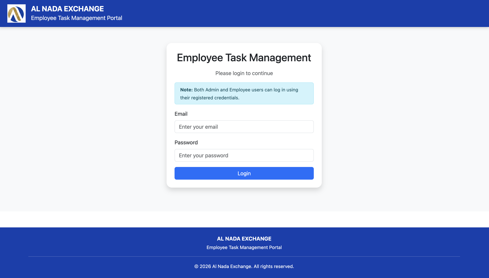
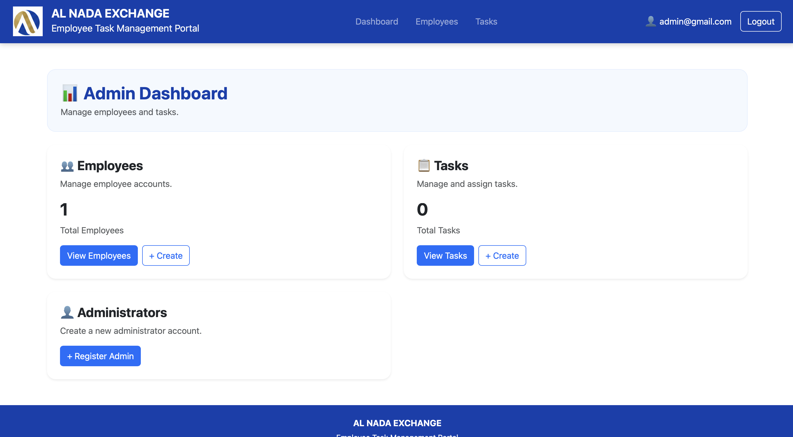
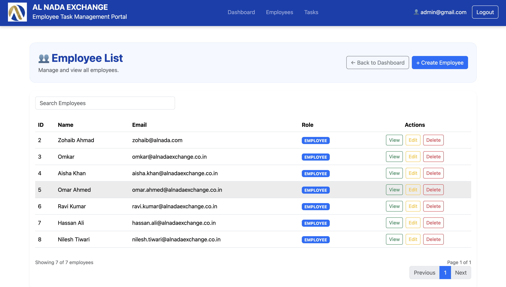
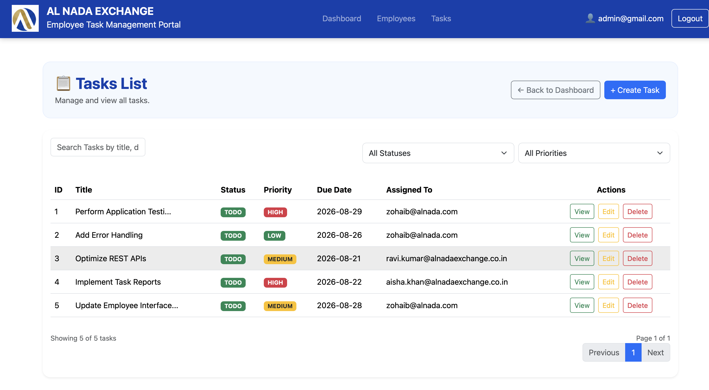
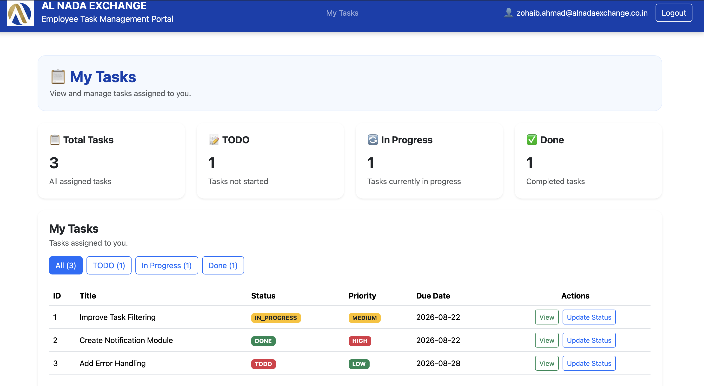

# Employee Task Management System

A full-stack RESTful web application built with **Spring Boot 3** (Backend) and **React.js + Vite** (Frontend) for managing employees, task assignments, priority tracking, and status workflows with Role-Based Access Control (RBAC) secured by JWT.

---

## Table of Contents
1. [Project Overview & Features](#project-overview--features)
2. [Tech Stack Used](#tech-stack-used)
3. [Docker Compose — Quick Start (Recommended)](#docker-compose--quick-start-recommended)
4. [Database Setup Details](#database-setup-details)
5. [Default Admin Credentials & Seed Instructions](#default-admin-credentials--seed-instructions)
6. [Backend Setup Steps](#backend-setup-steps)
7. [Frontend Setup Steps](#frontend-setup-steps)
8. [API Documentation & Testing Collections](#api-documentation--testing-collections)
9. [Important API Endpoints](#important-api-endpoints)
10. [Usage Flow](#usage-flow)
11. [Screenshots & Key Pages](#screenshots--key-pages)
12. [Assumptions Made](#assumptions-made)

---

## Project Overview & Features

The **Employee Task Management System** is designed to streamline organization workflows between Administrators and Employees.

### Key Features:
- **Authentication & RBAC**: Secure JWT-based authentication supporting `ADMIN` and `EMPLOYEE` roles.
- **Admin Dashboard**:
  - Full CRUD operations on Employee accounts (`Create`, `Read`, `Update`, `Delete`).
  - Create and assign tasks to employees with priority levels (`LOW`, `MEDIUM`, `HIGH`) and due dates.
  - View all organization tasks and filter by status or assignment.
- **Employee Portal**:
  - View tasks assigned specifically to the logged-in employee (`/api/tasks/my-tasks`).
  - Update progress status (`TODO`, `IN_PROGRESS`, `DONE`) for owned tasks.
- **Error Handling**: Standardized error payloads (`ErrorResponse`) for missing tokens, validation failures, or unauthorized operations.

---

## Tech Stack Used

- **Backend Framework**: Java 17, Spring Boot 3, Spring Security (JWT), Spring Data JPA / Hibernate
- **Database**: MySQL 8.0
- **Frontend Framework**: React.js 18, Vite, Axios, React Router v6
- **Containerization**: Docker, Docker Compose
- **API Documentation & Testing**: OpenAPI 3.1 (`API-Spec.json`), Postman Collection v2.1

---

## Database Setup Details

### 1. Create MySQL Database
Create a MySQL database named `task_db`:
```sql
CREATE DATABASE IF NOT EXISTS task_db;
```

### 2. Configure Spring Boot Connection
Update database credentials in [`backend/src/main/resources/application.yaml`](./backend/src/main/resources/application.yaml):
```yaml
spring:
  datasource:
    url: jdbc:mysql://localhost:3306/task_db
    username: root
    password: zohaib
  jpa:
    hibernate:
      ddl-auto: update
    show-sql: true
```

---

## Default Admin Credentials & Seed Instructions

Because initial registration and creation endpoints require `ADMIN` authorization, the **first initial Admin user must be added manually** to the database `users` table.

### Default Admin Credentials Table

| ID | Email | Name | Password (Plain) | Password (BCrypt Hash) | Role |
| :--- | :--- | :--- | :--- | :--- | :--- |
| `12` | `admin@gmail.com` | `Admin` | `admin123` | `$2a$12$2L7kDnl3VB/u2/qtWz9aM.Ggq..vlvjRc.T5q4yaqvsNC.TFYfmoS` | `ADMIN` |

---

### Manual SQL Seed Command
Run the following SQL query in MySQL Workbench or terminal to seed the initial Admin account:

```sql
USE task_db;

INSERT INTO users (id, email, name, password, role, created_at, updated_at) 
VALUES (
  12, 
  'admin@gmail.com', 
  'Admin', 
  '$2a$12$2L7kDnl3VB/u2/qtWz9aM.Ggq..vlvjRc.T5q4yaqvsNC.TFYfmoS', 
  'ADMIN', 
  NOW(), 
  NOW()
);
```

> **Note**: `$2a$12$2L7kDnl3VB/u2/qtWz9aM.Ggq..vlvjRc.T5q4yaqvsNC.TFYfmoS` is the BCrypt hash representation of the password `admin123`.

---

## Docker Compose — Quick Start (Recommended)

The easiest way to run the entire stack (MySQL + Backend + Frontend) with a **single command**.

### Prerequisites
- [Docker Desktop](https://www.docker.com/products/docker-desktop/) installed and running.

### Start the Full Stack
```bash
docker compose up --build
```
> On first run this downloads Docker images (~300MB). Subsequent runs are faster.

Once all containers are running, the services will be available at:

| Service | URL |
| :--- | :--- |
| **Frontend** | http://localhost:5173 |
| **Backend API** | http://localhost:8080 |
| **MySQL** | `localhost:3306` (DB: `task_db`, user: `root`, pass: `zohaib`) |

### Seed the First Admin (Required on First Run)
After containers start, run this **once** to insert the initial Admin account:
```bash
docker exec -it mysqldb mysql -u root -proot task_db -e \
  "INSERT IGNORE INTO users (email, name, password, role, created_at, updated_at) \
  VALUES ('admin@gmail.com', 'Admin', '\$2a\$12\$2L7kDnl3VB/u2/qtWz9aM.Ggq..vlvjRc.T5q4yaqvsNC.TFYfmoS', 'ADMIN', NOW(), NOW());"
```
Then login at http://localhost:5173 with `admin@gmail.com` / `admin123`.

### Stop the Stack
```bash
docker compose down
```

### Stop and Delete All Data (Fresh Reset)
```bash
docker compose down -v
```

### Other Useful Commands
| Command | Description |
| :--- | :--- |
| `docker compose up -d` | Start in background (detached mode) |
| `docker compose ps` | Check status of all containers |
| `docker compose logs -f` | Stream live logs from all services |
| `docker compose logs -f backend` | Stream backend logs only |
| `docker compose restart backend` | Restart a specific service |

---

## Backend Setup Steps

### Option A: Run via Terminal
1. Navigate to the backend directory:
   ```bash
   cd backend
   ```
2. Build and run the Spring Boot application:
   ```bash
   ./mvnw spring-boot:run
   ```
3. The server will start at `http://localhost:8080`.

### Option B: Run via Docker
```bash
docker-compose up --build backend
```

---

## Frontend Setup Steps

### Option A: Run via Terminal (Development Mode)
1. Navigate to the frontend directory:
   ```bash
   cd frontend
   ```
2. Install node packages:
   ```bash
   npm install
   ```
3. Start the development server:
   ```bash
   npm run dev
   ```
4. Access the web interface at `http://localhost:5173`.

### Option B: Run via Docker
```bash
docker-compose up --build frontend
```

---

## API Documentation & Testing Collections

### OpenAPI 3.1 Specification (`API-Spec.json`)
- **File Location**: [`API-Spec.json`](./API-Spec.json)
- **Features**:
  - Full request and response DTO schemas (`TaskRequest`, `TaskResponse`, `EmployeeRequest`, `EmployeeResponse`, `RegisterRequest`, `LoginRequest`, `ErrorResponse`, `DeleteResponse`).
  - Summaries and tags for all 14 REST operations.
  - Complete real saved response examples for status codes (`200 OK`, `201 Created`, `400 Bad Request`, `401 Unauthorized`, `403 Forbidden`, `404 Not Found`, `409 Conflict`).

### Postman Collection (`Employee Task Management System.postman_collection.json`)
- **File Location**: [`Employee Task Management System.postman_collection.json`](./Employee%20Task%20Management%20System.postman_collection.json)
- **Features**:
  - Complete suite of requests categorized under Authentication, Employee, and Task folders.
  - Saved sample response examples for success and error edge cases.
- **Import Instructions**:
  1. Open Postman -> Click **Import**.
  2. Choose `Employee Task Management System.postman_collection.json`.
  3. Ensure `{{URL}}` environment variable is set to `http://localhost:8080`.

---

## Important API Endpoints

| Method | Endpoint | Description | Role Required |
| :--- | :--- | :--- | :--- |
| `POST` | `/api/auth/login` | Login user & return JWT Bearer token | Public |
| `POST` | `/api/auth/register` | Register a new Admin account | Admin |
| `GET` | `/api/employees` | Get all employees | Admin |
| `POST` | `/api/employees` | Create new employee profile | Admin |
| `GET` | `/api/employees/{id}` | Get employee profile by ID | Admin |
| `PUT` | `/api/employees/{id}` | Update employee profile details | Admin |
| `DELETE` | `/api/employees/{id}` | Delete employee account | Admin |
| `GET` | `/api/tasks` | Get all tasks across organization | Admin |
| `POST` | `/api/tasks` | Create and assign a task | Admin |
| `GET` | `/api/tasks/{id}` | Get task details by ID (Employee can only view their own) | Admin, Employee |
| `PUT` | `/api/tasks/{id}` | Update task details or assignment | Admin |
| `DELETE` | `/api/tasks/{id}` | Delete a task | Admin |
| `GET` | `/api/tasks/my-tasks` | Get tasks assigned to logged-in employee | Employee |
| `PUT` | `/api/tasks/{id}/status` | Update task status (`TODO`, `IN_PROGRESS`, `DONE`) | Employee |

---

## Usage Flow

### Step 1 — Admin Logs In
1. Open **http://localhost:5173**
2. Login with seeded admin credentials:
   - **Email**: `admin@gmail.com`
   - **Password**: `admin123`
3. Admin is redirected to the **Admin Dashboard**.

---

### Step 2 — Admin Creates an Employee Account
1. Navigate to the **Employees** section in the Admin Dashboard.
2. Click **"Add Employee"** and fill in the form:
   - Name, Email, Password
3. Click **Submit** — the employee account is created via `POST /api/employees` with `Role.EMPLOYEE` hardcoded.

---

### Step 2b — Admin Registers Another Admin (Optional)
1. Navigate to **Register Admin** in the navbar (`/admin/register`).
2. Fill in Name, Email, Password.
3. Click **Submit** — the new account is created via `POST /api/auth/register` with `Role.ADMIN` hardcoded.

---

### Step 3 — Admin Assigns a Task to the Employee
1. Navigate to the **Tasks** section.
2. Click **"Create Task"** and fill in:
   - Title, Description, Priority (`LOW` / `MEDIUM` / `HIGH`), Due Date
   - Select the employee from the **Assigned To** dropdown (only EMPLOYEE-role users appear)
3. Click **Submit** — task is created via `POST /api/tasks`.

---

### Step 4 — Employee Logs In
1. Open **http://localhost:5173** (or logout from Admin).
2. Login with the employee credentials created in Step 2.
3. Employee is redirected to their **My Tasks** portal.

---

### Step 5 — Employee Updates Task Status
1. Employee sees only tasks assigned to them.
2. Click on a task and update the status:
   - `TODO` -> `IN_PROGRESS` -> `DONE`
3. Status is updated via `PUT /api/tasks/{id}/status`.

---

## Screenshots & Key Pages

### Login Screen


### Admin Dashboard


### Employee Management


### Task List


### Employee My Tasks


| Page | Description |
| :--- | :--- |
| **Login Screen** | Authentication portal for Admin and Employee accounts |
| **Admin Dashboard** | Overview of all system tasks, status indicators, and employee metrics |
| **Employee Management** | Admin page to add, edit, and view employee accounts |
| **Task Assignment View** | Admin dialog to assign tasks with priority and due dates |
| **Employee My Tasks** | Dedicated view for employees to track and update task progress |

---

## Assumptions Made

1. **Initial Admin Provisioning**: Registration and employee creation endpoints require `ADMIN` authorization. Therefore, the first admin user (`admin@gmail.com`) must be manually inserted into the `users` table upon initial setup.
2. **Task Assignment Constraints**: Tasks can only be assigned to users with the `EMPLOYEE` role. Tasks cannot be assigned to `ADMIN` accounts.
3. **Employee Self-Management Permissions**: Employees are restricted to viewing tasks assigned specifically to them (`/api/tasks/my-tasks`) and updating the status field of their assigned tasks. They cannot edit task titles, descriptions, priorities, or assignees.
4. **Admin Account Protection**: No admin account can be deleted via the API. The `DELETE /api/employees/{id}` endpoint throws a `403 Forbidden` error if the target user has the `ADMIN` role.
5. **JWT Token Lifecycle**: JWT tokens are signed using HMAC-SHA (algorithm determined by key length) with a configured secret key and expire after 50 minutes (3,000,000 ms).
6. **CORS Policy**: The backend allows cross-origin requests only from `http://localhost:5173`. To deploy to a different frontend URL, update the `CorsConfiguration` in `SecurityConfig.java`.
